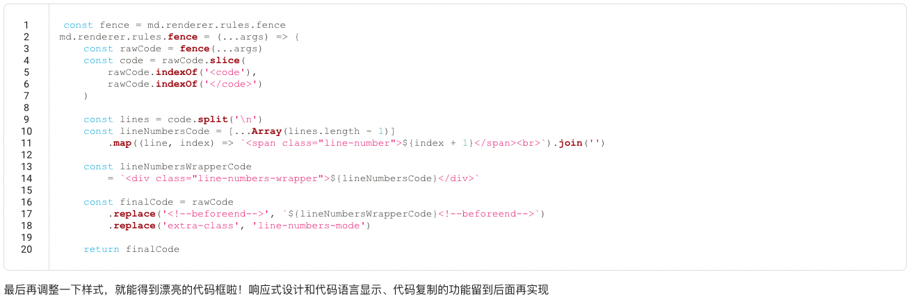

# 建站日记【二】

今天的目标是做出好看的代码高亮效果，目前对markdown-it支持度比较好的模块是`highlight.js`和`prism`，其中highlight.js的可玩性比较低，没有行号、高亮某一行这样的功能，prism可以很方便地通过插件实现这些功能。于是我选择了prism，但困难马上就出现了，在markdown-it渲染markdown文件时，是没有DOM结构的，这时候只有tokens，所以针对DOM结构渲染的prism插件是没有办法工作的，但是我发现VuePress可以很方便的实现这些功能，去看了下[VuePress](https://github.com/vuejs/vuepress/tree/master/packages/%40vuepress/markdown/lib)的源码，发现这些功能都是他们自己写的。

钻研了一下`markdown-it`的[文档](https://github.com/markdown-it/markdown-it/blob/master/docs/architecture.md)，`markdown-it`的数据结构为Token流，`markdown-it`维护了一个Token流数组，数组里的每一个元素都是一个Token对象，一个Token对象里也可以嵌套另一个Token对象，下面👇是一个`<h1>`标签的Token
```json
{
    "type": "heading_open",
    "tag": "h1",
    "attrs": null,
    "map": [
      0,
      1
    ],
    "nesting": 1,
    "level": 0,
    "children": null,
    "content": "",
    "markup": "#",
    "info": "",
    "meta": null,
    "block": true,
    "hidden": false
  }
```
`type`属性表示当前Token的描述，这里的"heading_open"代表这是一个开`h1`标签，`tag`属性明确说明了该Token的标签名称，`content`属性存储了该Token的内容，显然`<h1>`标签是没有内容的，下面展示一个有内容的Token
```json
{
        "type": "text",
        "tag": "",
        "attrs": null,
        "map": null,
        "nesting": 0,
        "level": 0,
        "children": null,
        "content": "hello",
        "markup": "",
        "info": "",
        "meta": null,
        "block": false,
        "hidden": false
      }
```
更多关于Token的详细信息可以从这个[demo](https://markdown-it.github.io/)中的debug模式找到。
回到代码高亮，代码语句"\`\`\`\[language\]\{code\}\`\`\`"能够自动被`markdown-it`监测到，对应的Token的type是“fence”，该Token的info属性记录了\[language\]，`markdown-it`也实现了对应的renderer的rules，这个fnece规则最主要的功能就是把代码和\[language\]提取出来，最后包装成html：
```js
return  '<pre><code' + slf.renderAttrs(token) + '>'
    + highlighted
    + '</code></pre>\n';
```
为了实现显示行号功能，我们希望在外边再包裹一层标签，然后在里边再添加一个标签，标签里的内容为对应的行号。于是考虑利用原来的rules，再在外边嵌套一层，代码实现如下：
```js
const wrap = (wrapped) => (...args) => {
        const [tokens, idx] = args
        const token = tokens[idx]
        const rawCode = wrapped(...args)
        return `<!--beforebegin--><divclass="language-${token.info.trim()} extra-class">`
            + `<!--afterbegin-->${rawCode}<!--beforeend--></divclass=><!--afterend-->`
    }
    const { fence } = md.renderer.rules
    md.renderer.rules.fence = wrap(fence)
```
接着去完成行号的rules，首先取出上面返回的字符串，选出<code></code>间的内容，然后把这个内容按换行切分，接着就可以渲染出行号。
```js
const fence = md.renderer.rules.fence
md.renderer.rules.fence = (...args) => {
    const rawCode = fence(...args)
    const code = rawCode.slice(
        rawCode.indexOf('<code'),
        rawCode.indexOf('</code>')
    )

    const lines = code.split('\n')
    const lineNumbersCode = [...Array(lines.length - 1)]
        .map((line, index) => `<span class="line-number">${index + 1}</span><br>`).join('')

    const lineNumbersWrapperCode
        = `<div class="line-numbers-wrapper">${lineNumbersCode}</div>`

    const finalCode = rawCode
        .replace('<!--beforeend-->', `${lineNumbersWrapperCode}<!--beforeend-->`)
        .replace('extra-class', 'line-numbers-mode')

    return finalCode
```
最后再调整一下样式，就能得到漂亮的代码框啦！响应式设计和代码语言显示、代码复制的功能留到后面再实现
- [ ] 响应式
- [ ] 代码语言显示
- [ ] 代码复制
- [ ] 一篇文章显示多个代码块，嵌套逻辑不对



## 明日目标
- [ ] 为每篇文章生成一个链接，并通过点击卡片导航进入
- [ ] checkbox渲染
- [ ] 图片渲染
